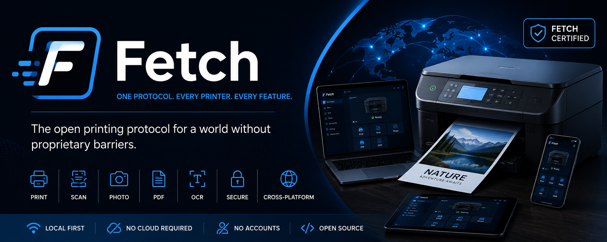

# Fetch 🖨️

[](LICENSE)
[](#)

> **Humans and Paper alike. (cringe, ik)**

Fetch is an open-source printing protocol and ecosystem designed to make printing and scanning simple, universal, and manufacturer-independent. 

No proprietary apps. No cloud accounts. No vendor lock-in.

---

## Why Fetch?

Modern printers are unnecessarily complicated. Every manufacturer has its own app, setup process, drivers, and ecosystem. Even basic tasks like connecting a new printer can be frustrating.

Fetch aims to solve this by creating **one open protocol** that every printer and every app can use.

## The Vision

Imagine buying a printer:
1. Connect it to Wi-Fi.
2. Open any Fetch-compatible app.
3. Your printer appears instantly.
4. Press **Print**.

No searching for drivers. No downloading manufacturer software. No creating an account.

---

## Quickstart (Monorepo)

This repository serves as a monorepo containing a reference implementation of a Fetch-compatible printer simulator and a modern web dashboard.

### Prerequisites
- Node.js (v18+)

### Setup

```bash
# Clone the repository
git clone https://github.com/your-org/fetch.git
cd fetch

# Install dependencies across all workspaces
npm install

# Start the simulator and the web client
npm start
```

---

## Features & Design Principles

### 1. Universal & Feature Equality
Every Fetch-compatible printer works with every Fetch-compatible application. If a printer supports a feature (e.g., Duplex printing, OCR, Ink levels), every Fetch app can access it. Manufacturers cannot artificially limit features.

### 2. Local First
Fetch works entirely on your local network. No cloud services, no accounts, and no internet connection required.

### 3. Cross Platform
Designed for Android, iOS, Windows, macOS, Linux, and ChromeOS.

### 4. Automatic Discovery
Fetch leverages existing local network discovery technologies (mDNS/Bonjour) so compatible printers appear automatically without requiring IP addresses or manual configuration.

---

## Fetch Certified
A printer may display the **Fetch Certified** badge only if it meets all certification requirements, including full protocol compatibility, accurate capability reporting, and reliable interoperability.

## Contributing
We welcome contributions! Whether you're a developer, a hardware engineer, a printer manufacturer, or a designer, please read our [Contributing Guide](CONTRIBUTING.md).

## License
[MIT License](LICENSE) (Planned)

> **A printer's capabilities belong to the user, not to the manufacturer's app.**
